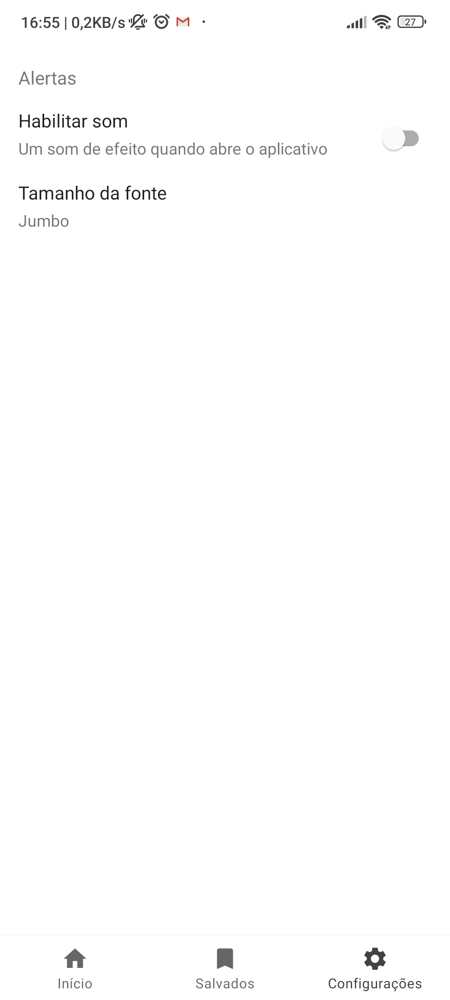
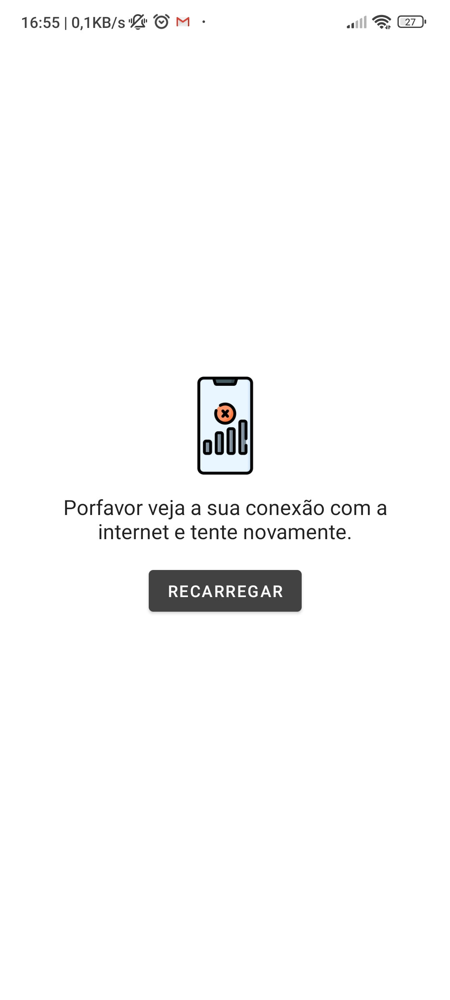
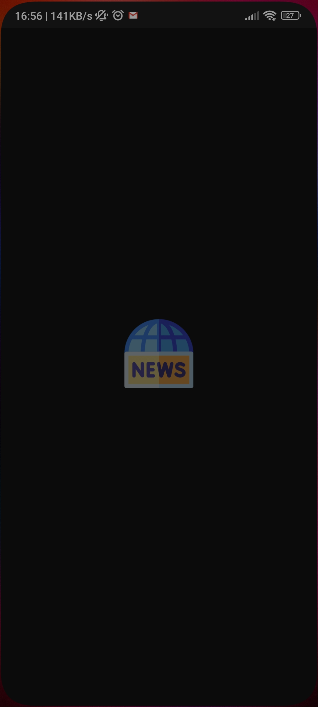
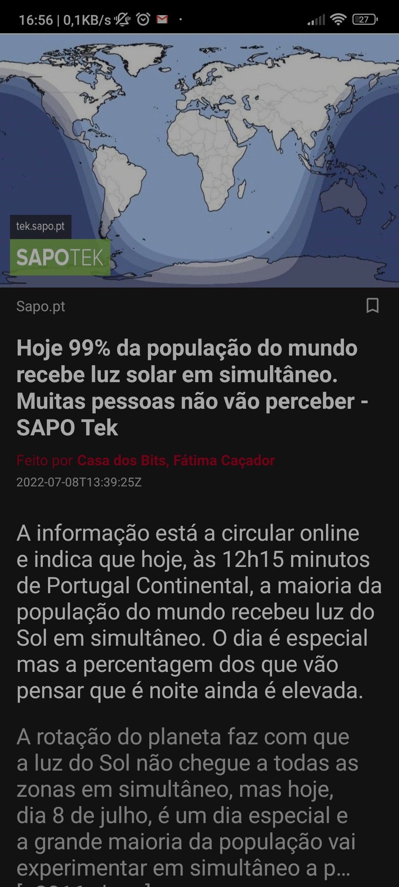
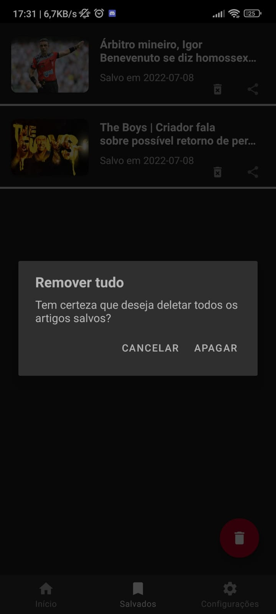
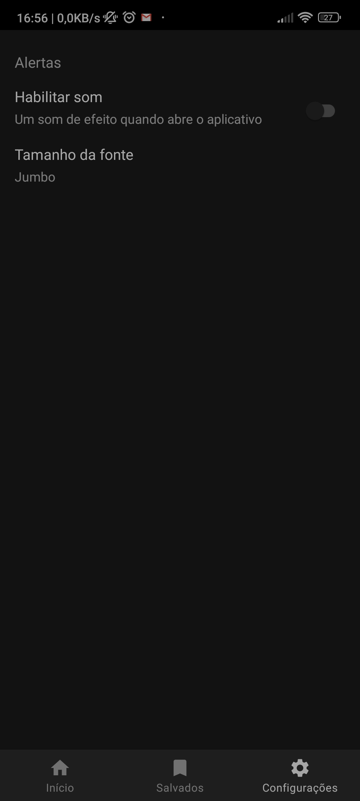
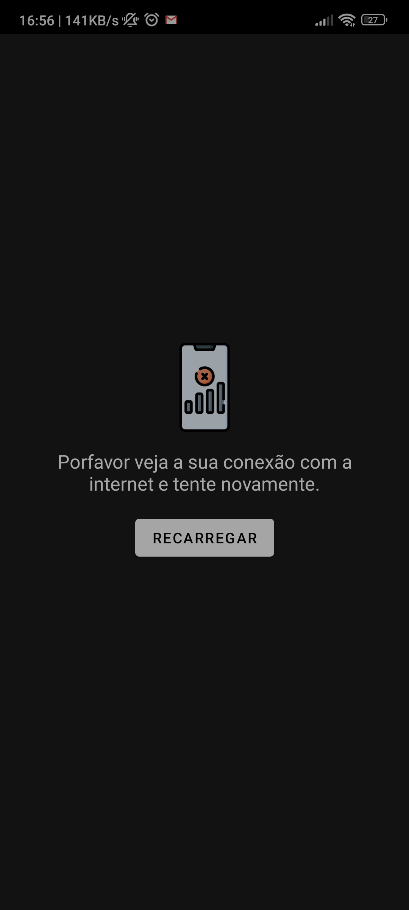

# Solução Desafio Santander Dio  News App    


███╗░░██╗███████╗░██╗░░░░░░░██╗░██████╗  ░█████╗░██████╗░██████╗░
████╗░██║██╔════╝░██║░░██╗░░██║██╔════╝  ██╔══██╗██╔══██╗██╔══██╗
██╔██╗██║█████╗░░░╚██╗████╗██╔╝╚█████╗░  ███████║██████╔╝██████╔╝
██║╚████║██╔══╝░░░░████╔═████║░░╚═══██╗  ██╔══██║██╔═══╝░██╔═══╝░
██║░╚███║███████╗░░╚██╔╝░╚██╔╝░██████╔╝  ██║░░██║██║░░░░░██║░░░░░
╚═╝░░╚══╝╚══════╝░░░╚═╝░░░╚═╝░░╚═════╝░  ╚═╝░░╚═╝╚═╝░░░░░╚═╝░░░░░

## Navegue aqui :3
* [Informações gerais](#informações-gerais)
* [Capturas de tela](#screenshots)
* [Tecnologias](#tecnologia)
* [Setup](#setup)
* [License](#license)

## Informações gerais

Antes de tudo, se você é um dos inspetores que vão analizar meu código, preciso me explicar,
esse aplicativo foi feito em KOTLIN e não java como proposto pelo desafio, além disso,
não fiz apenas à notícias de futebol,
visto que preferi me arriscar em terras novas e seguir um desafio de verdade,
seguindo não apenas o aplicativo proprosto em JAVA e sobre FUTEBOL nas aulas.
Sendo posto, adicionei um setor de negócios que está relacionado ao programa Santander,
além de outros variados tópicos (incluso o de esportes). Agora podemos proseguir :)

Os tópicos são inclusos em quatro categorias: **Melhores**, **Negócios**, **Inovação**, **Esportes**.
Tudo implementado com o princípio SOLID, e Clean Code, além disso foi utilizado a api do Google para requisição das notícias.


## Screenshots

## Light Theme
  

<p float="left">
  
   
  
  
  
  
  
</p>

## Dark Theme  

<p float="left">
  
   
  
  
  
  
  
</p>

## Tecnologia

#### Linguagens:
- Kotlin 
- Xml

#### Arquitetura usada:
- MVVM

#### Libraries:
- Retrofit  2.9.0 (https://square.github.io/retrofit/)
- Gson      2.9.6 (https://github.com/google/gson)
- Room      2.4.2 (https://developer.android.com/training/data-storage/room)
- Glide     4.13.0 (https://github.com/bumptech/glide)
- Coroutine 1.6.1 (https://developer.android.com/kotlin/coroutines)
- Paging    3.1.1 (https://developer.android.com/topic/libraries/architecture/paging/v3-overview)
- Hilt      2.40.1 (https://developer.android.com/training/dependency-injection/hilt-android)
- ViewPager 1.0.0 (https://developer.android.com/jetpack/androidx/releases/viewpager2)
- ViewModel, LiveData, Viewbinding 2.4.1 (https://developer.android.com/jetpack/androidx/releases/lifecycle)

## Setup

Para rodar esse projeto, instale-o baixando ou clonando o repositório.
Então registre no website da api (https://newsapi.org/s/google-news-api) 
para pegar a sua chave principal (substitua ela pela atual em data/local/Constants.kt/API_KEY)

#### Requisitos do sistema 
- Ter um computador
- Android Studio Chipmunk | 2021.2.1
- Minimum sdk v21
- Build tool v30.0.3
- Compile sdk v32


## Licença

```html
MIT Licence 

Copyright (c) 2022 Wanderley Filho

Permission is hereby granted, free of charge, to any person obtaining a copy of this software
and associated documentation files (the "Software"), to deal in the Software without restriction,
including without limitation the rights to use, copy, modify, merge, publish, distribute, sublicense,
and/or sell copies of the Software, and to permit persons to whom the Software is furnished to do so, 
subject to the following conditions:

The above copyright notice and this permission notice shall be included in all copies or substantial 
portions of the Software.

THE SOFTWARE IS PROVIDED "AS IS", WITHOUT WARRANTY OF ANY KIND, EXPRESS OR IMPLIED, 
INCLUDING BUT NOT LIMITED TO THE WARRANTIES OF MERCHANTABILITY, FITNESS FOR A PARTICULAR PURPOSE
AND NONINFRINGEMENT.IN NO EVENT SHALL THE AUTHORS OR COPYRIGHT HOLDERS BE LIABLE FOR ANY CLAIM,
DAMAGES OR OTHER LIABILITY, WHETHER IN AN ACTION OF CONTRACT,
TORT OR OTHERWISE, ARISING FROM, OUT OF OR IN CONNECTION WITH THE SOFTWARE
OR THE USE OR OTHER DEALINGS IN THE SOFTWARE.
```
